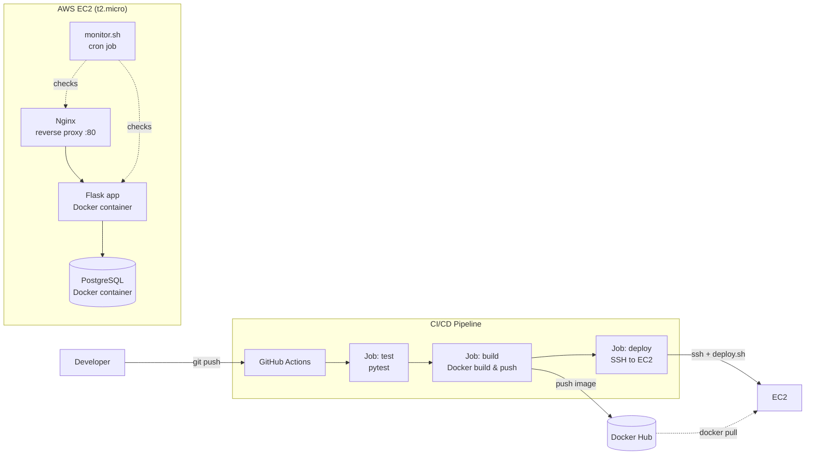

# Flask DevOps Pipeline

End-to-end DevOps pipeline for a containerized Flask application — from
`git push` to a running, monitored production deployment on AWS EC2.

This project is not about the application itself (it's intentionally minimal).
The focus is the **infrastructure and automation** around it: containerization,
CI/CD, cloud deployment, and monitoring.

**Live demo:** [http://98.82.190.66](http://98.82.190.66) · [/health](http://98.82.190.66/health)

## Architecture



## Tech Stack

| Layer | Technology |
|---|---|
| Application | Flask (Python) |
| Database | PostgreSQL (Docker container) |
| Reverse proxy | Nginx |
| Containerization | Docker, Docker Compose |
| CI/CD | GitHub Actions |
| Image registry | Docker Hub |
| Cloud | AWS EC2 |
| Monitoring | Bash scripts + cron |

## Application endpoints

| Method | Path | Response |
|---|---|---|
| GET | `/` | `{"status": "ok", "version": "<APP_VERSION>"}` |
| GET | `/health` | `{"status": "healthy"}` (HTTP 200) — used by deploy health checks and monitoring |

## CI/CD pipeline

`.github/workflows/ci-cd.yml` runs on every push:

1. **test** — installs dependencies and runs the pytest suite
2. **build** — (on push to `main` only) builds the Docker image and pushes it to
   Docker Hub, tagged with both `latest` and the commit SHA
3. **deploy** — SSHes into the EC2 instance and runs `scripts/deploy.sh`,
   which pulls the new image, runs a health-check loop, and automatically
   rolls back on failure

## Running locally

```bash
# Clone and enter the project
git clone https://github.com/EdenfromWISE/flask-devops-pipeline.git
cd flask-devops-pipeline

# Run the full stack (Flask + PostgreSQL + Nginx) with Docker Compose
docker compose up --build -d

# Verify
curl http://localhost/health
# → {"status": "healthy"}
```

## Running tests

```bash
cd app
pip install -r requirements.txt
pytest tests/ -v
```

## Project structure

```
flask-devops-pipeline/
├── app/                    # Flask application + tests
├── docker-compose.yml      # Local multi-container orchestration
├── Dockerfile              # Multi-stage, non-root container build
├── scripts/
│   ├── deploy.sh           # Pull image, health check, auto rollback
│   └── monitor.sh          # CPU/RAM/disk/container/endpoint monitoring
├── infra/
│   └── setup-ec2.sh        # EC2 bootstrap script
└── .github/workflows/
    └── ci-cd.yml           # test → build & push → deploy
```

## Status

- [x] Flask app with `/` and `/health` endpoints
- [x] Multi-stage Dockerfile with non-root user
- [x] Docker Compose (app + PostgreSQL + Nginx)
- [x] CI pipeline — automated tests on every push
- [x] CD pipeline — build & push to Docker Hub (tagged `latest` + commit SHA)
- [x] Automated deployment to AWS EC2 with health-check verification and rollback
- [x] Monitoring via cron + Bash scripts (CPU/RAM/disk/containers/endpoint)
